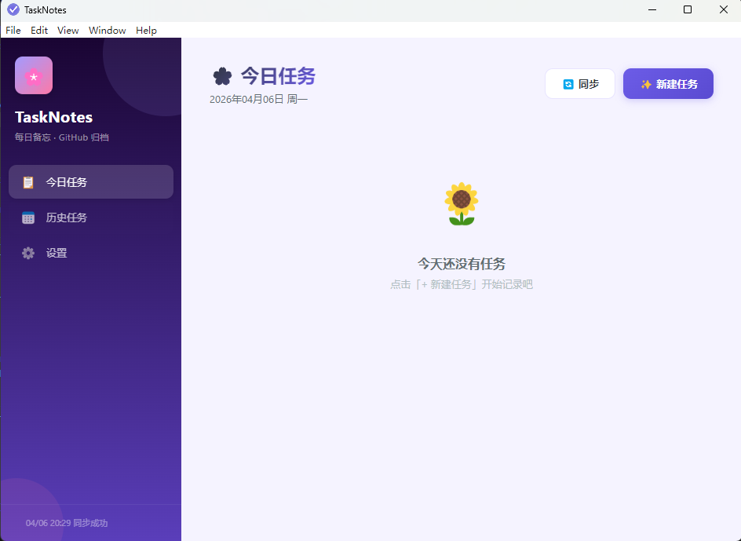
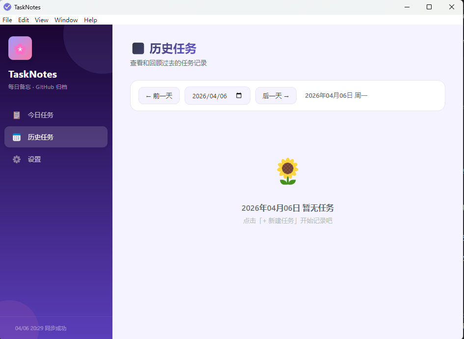
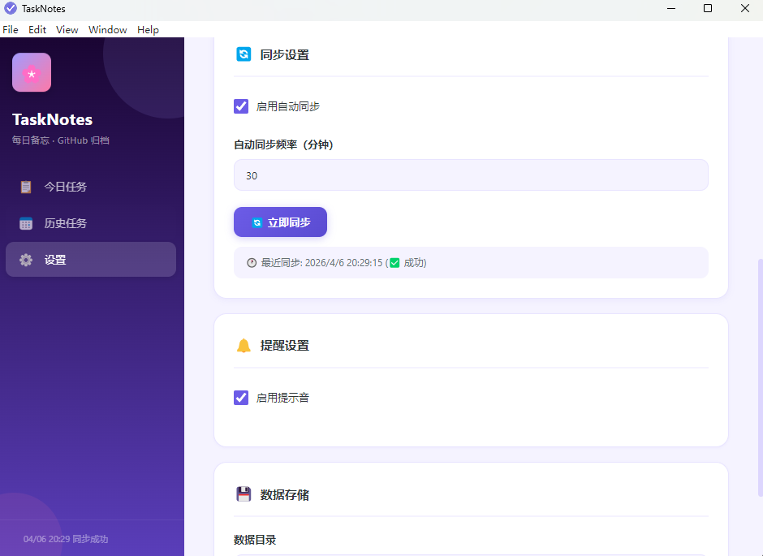

# TaskNotes

一款轻量级桌面任务管理工具，支持每日任务管理、桌面提醒和 GitHub 云端同步。

   

---

## 功能特性

- **每日任务管理** — 按日期创建、编辑、完成和删除任务
- **桌面提醒** — 原生系统通知 + 应用内提醒横幅
- **GitHub 自动同步** — 任务数据备份到 GitHub 仓库，支持自动同步
- **系统托盘** — 后台静默运行，托盘图标快速操作
- **紫蓝现代主题** — 简洁美观的紫色系界面
- **跨平台** — 支持 Windows、macOS、Linux

---

## 截图

| 今日任务 | 设置页面 | 提醒横幅 |
|:---:|:---:|:---:|
|  |  |  |

---

## 快速开始

### 环境要求

- Node.js 18+
- npm 9+
- Git

### 安装运行

```bash
# 克隆仓库
git clone https://github.com/qiuqionglin/TaskNotes.git
cd TaskNotes

# 安装依赖
npm install

# 开发模式启动
npm run dev
```

### 构建应用

```bash
# 构建当前平台的可移植版本（Windows 为 .exe）
npm run package

# 构建安装包
npm run package:installer
```

构建产物位于 `release/` 目录。

---

## 使用教程

### 配置 GitHub 同步

1. 进入 **设置** 页面
2. 生成 GitHub 个人访问令牌（Personal Access Token）：
   - GitHub → Settings → Developer settings → Personal access tokens → Tokens (classic)
   - 勾选 `repo` 权限（完全控制私有仓库）
   - 点击 Generate token，复制生成的 token
3. 填写设置：
   - **GitHub Token**：填入 `ghp_xxxxxxxxxxxxx`
   - **仓库名**：格式 `用户名/仓库名`，例如 `qiuqionglin/task-notes`
   - **分支名**：默认 `main`
   - **根目录路径**：仓库中存储任务的文件夹，例如 `tasks`
4. 点击 **保存设置**，然后点击 **立即同步** 测试

同步成功后，任务将按日期存储到仓库的 `tasks/YYYY/MM/YYYY-MM-DD.json`。

### 创建任务

1. 在今日页面点击 **✨ 新建任务**
2. 填写：
   - **标题**（必填）
   - **内容**（可选）
   - **日期** — 默认为今天，可选择任意日期
   - **提醒** — 开启并设置时间，到点会收到桌面通知
3. 点击 **保存**

### 修改数据存储路径

默认数据存储在：
- **Windows**：`C:\Users\<用户名>\AppData\Roaming\task-notes\task-notes-data`

修改路径：
1. 进入 **设置** → **💾 数据存储**
2. 修改 **数据目录** 路径
3. 保存后重启应用生效

---

## 项目结构

```
task-notes/
├── electron/               # 主进程（Electron）
│   ├── main.ts            # 入口，窗口管理
│   ├── preload.ts         # 上下文桥接（IPC 暴露）
│   ├── ipc/
│   │   └── handlers.ts    # IPC 请求处理
│   └── services/
│       ├── store.ts       # 本地数据存储（JSON 文件）
│       ├── github.ts      # 通过 Octokit 实现 GitHub 同步
│       ├── reminder.ts    # 桌面通知与定时器
│       ├── logger.ts      # 应用日志
│       └── tray.ts        # 系统托盘管理
├── src/                   # 渲染进程（React）
│   ├── App.tsx           # 根组件
│   ├── pages/
│   │   ├── TodayPage.tsx
│   │   ├── HistoryPage.tsx
│   │   └── SettingsPage.tsx
│   ├── components/
│   │   ├── Sidebar.tsx
│   │   ├── TaskList.tsx
│   │   ├── TaskItem.tsx
│   │   └── TaskModal.tsx
│   ├── types/
│   │   └── index.ts      # 共享 TypeScript 类型
│   └── styles/
│       └── global.css
├── webpack.*.config.js   # Webpack 配置（主进程、渲染进程）
├── package.json
└── tsconfig.json
```

---

## 数据格式

任务以 JSON 文件按日期存储：

```json
// tasks/2026/04/2026-04-06.json
{
  "date": "2026-04-06",
  "tasks": [
    {
      "id": "uuid-v4",
      "title": "Review PR",
      "content": "检查新的认证模块",
      "taskDate": "2026-04-06",
      "remindAt": "2026-04-06T14:00:00.000Z",
      "isReminderEnabled": true,
      "isCompleted": false,
      "reminderStatus": "pending",
      "githubSyncStatus": "pending",
      "createdAt": "2026-04-06T10:00:00.000Z",
      "updatedAt": "2026-04-06T10:00:00.000Z"
    }
  ]
}
```

---

## 配置项说明

| 配置项 | 说明 | 默认值 |
|--------|------|--------|
| `githubToken` | GitHub 个人访问令牌 | `""` |
| `githubRepo` | 目标仓库（owner/repo） | `""` |
| `githubBranch` | 同步分支 | `"main"` |
| `githubBasePath` | 仓库中任务文件的根目录 | `"tasks"` |
| `autoSyncEnabled` | 开启自动同步 | `false` |
| `autoSyncIntervalMinutes` | 自动同步间隔（分钟） | `30` |
| `soundEnabled` | 提醒时播放提示音 | `true` |
| `dataDir` | 本地数据存储目录 | （系统默认） |

---

## 许可证

MIT License — 详见 [LICENSE](LICENSE)。

---

## 欢迎贡献

Issues 和 Pull Requests 皆欢迎！
